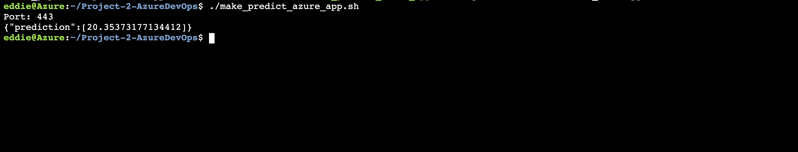

# Overview
[](https://github.com/eddiebrunson/Project-2-AzureDevOps/actions/workflows/main.yml)

This is the second project in the [Cloud DevOps using Microsoft Azure Nanodegree](https://www.udacity.com/course/cloud-devops-using-microsoft-azure-nanodegree--nd082). The project is called **Building a CI/CD Pipeline**, where I built a Continuous Delivery pipeline that deploys a *Flask Machine Learning application* using Azure Pipelines to Azure App Services.     

First, I used Github Actions along with a .txt file and application code to perform an initial lint, test, and install cycle on a machine learning application running in Flask in Azure App Services. Then, I integrated **Continuous Delivery** using Azure Pipelines to deploy tested application changes automatically to production. 

Finally, I tested the prediction capability of my machine learning application deployed into production and built a [demo Youtube screenscast]() that demonstrates my proficiency in Continuous Delivery with Azure. 

## Project Plan


* [Trello board for the project](https://trello.com/invite/b/OIrjZeeW/0d6b20b36d17f7f8567cca17c832933f/p2-building-a-ci-cd-pipeline)
* [Spreadsheet that includes the original and final project plan](https://github.com/eddiebrunson/Project-2-AzureDevOps/blob/170c99bb5d3ec7fc2937ae2a841d129868ca92b6/project-management-plan2021.xlsx)

## Instructions
___


 
## Architectural Diagrams (Shows how key parts of the system work)
___


# Major Project Steps
___

## 1. Create Github Repo

a). Go to [Github.com](www.github.com) and create a new repo for this project


## 2. Create Project files

     a). Create requirements.txt file
     Create a file called requirements.txt and paste the below into it: 
```txt
Flask==1.0.2
pandas==0.24.2
scikit-learn==0.20.3
pylint
pytest 
```


     b). Create hello.py file to it's test file called test_hello.py
     Copy and paste the code below into a file called hello.py:

```Python
def toyou(x):
    return "hi %s" % x


def add(x):
    return x + 1


def subtract(x):
    return x - 1
```

    Copy and paste the code below into a file called test_hello.py:
```Python 
from hello import toyou, add, subtract


def setup_function(function):
    print("Running Setup: %s" % function.__name__)
    function.x = 10


def teardown_function(function):
    print("Running Teardown: %s" % function.__name__)
    del function.x


### Run to see failed test
#def test_hello_add():
#    assert add(test_hello_add.x) == 12

def test_hello_subtract():
    assert subtract(test_hello_subtract.x) == 9

```
     c). Create a Makefile 
     Copy and paste the code below into a file called Makefile. 
```Makefile
setup:
	python3 -m venv ~/.udacity-devops

install:
	pip install --upgrade pip &&\
		pip install -r requirements.txt

test:
	#python -m pytest -vv --cov=myrepolib tests/*.py
	#python -m pytest --nbval notebook.ipynb
	python -m pytest -vv test_hello.py


lint:
	#hadolint Dockerfile #uncomment to explore linting Dockerfiles
	pylint --disable=R,C,W1203,W0702 app.py

all: install lint test

```
    d). Set Up the Python Virtual Environment 

```
pip install virtualenv 
virtualenv ~/.udacity-devops
source ~/.udacity-devops/bin/activate 

```

## 3. Create an Azure Cloud Shell Environment 

   a.) Log into [portal.azure.com](portal.azure.com)

   b.) Open the Azure Cloud Shell Terminal at the top right corner the icon will looks like this `>_`


  c.) Create a public key to upload to Github so that you can later clone your project using the Azure Cloud Shell

## 4. Test Locally 

a.) Run `make all` in your local terminal to install the project requirements, lint, and test your project code. 


b.) Once the `make all` results in a `PASSED` then you can run the web application locally. Using the command `python app.py`    


c.) Now use this command to run the prediction `./make_prediction.sh`


## 5. Clone Project to Azure Cloud Shell

    a.) In the Azure Cloud Shell clone the project using the following commands:


## 6. Set up Github Actions 

   a.) In Github select `Actions` tab and create your own, copy the below code and name it <filename>.yml: 

```yml
name: Python application test with Github Actions

on: [push]

jobs:
  build:

    runs-on: ubuntu-latest

    steps:
    - uses: actions/checkout@v2
    - name: Set up Python 3.5
      uses: actions/setup-python@v1
      with:
        python-version: 3.5
    - name: Install dependencies
      run: |
        make install
    - name: Lint with pylint
      run: |
        make lint
    - name: Test with pytest
      run: |
        make test
```


### Github Actions Pass


## 7. Set Up Azure Pipelines 


### Azure Pipelines Success 


### Azure Pipelines Success Details 


### Azure Cloud Make all


### Azure Cloud Prediction 



## 8. Stream Logs
a.) Stream logs using `https://<yourappname>.scm.azurewebsites.net/api/logs/docker


## 9. Load Test with Locust 

a.) Install locust for mac use `python3 -m pip install locust` for other install options visit [Locust Installation](https://docs.locust.io/en/0.12.2/installation.html)

b.) Run the load test with this command `locust -f ./locustfile.py`

c) Open the link provided `http://0.0.0.0:8089` and configure with the azure hosted app address and how many users to emulate. 

### Locust Test


### Locust Stats


### Locust Chart


## Enhancements
____

The following are a few enhancements that can be made to this project: 

1. Increase the production quality of the demo video
2. Set up production style github branching 
3. Create a Kubernetes version of this project
4. Remove the Azure Pipelines and only use Github actions. Document the pros and cons of both approaches


## Demo 
____

Here is a link to the [Youtube Project screencast]() I made walking through the main steps of this project. 


